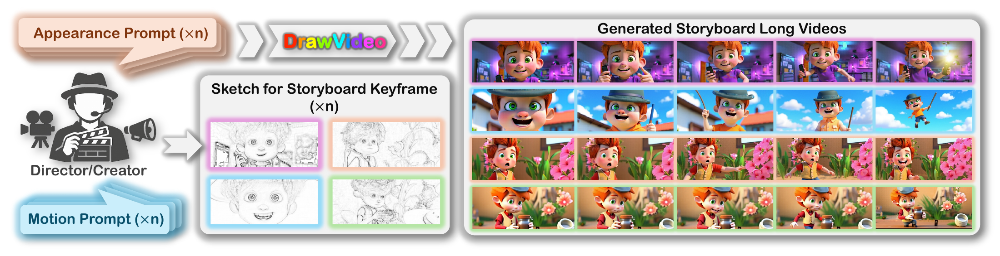
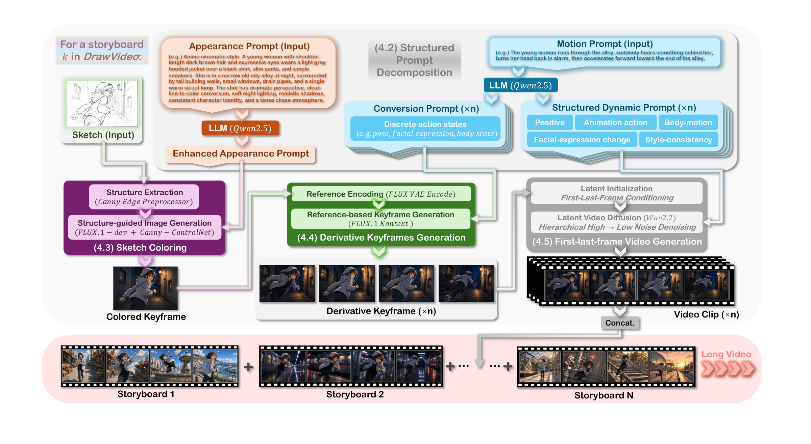
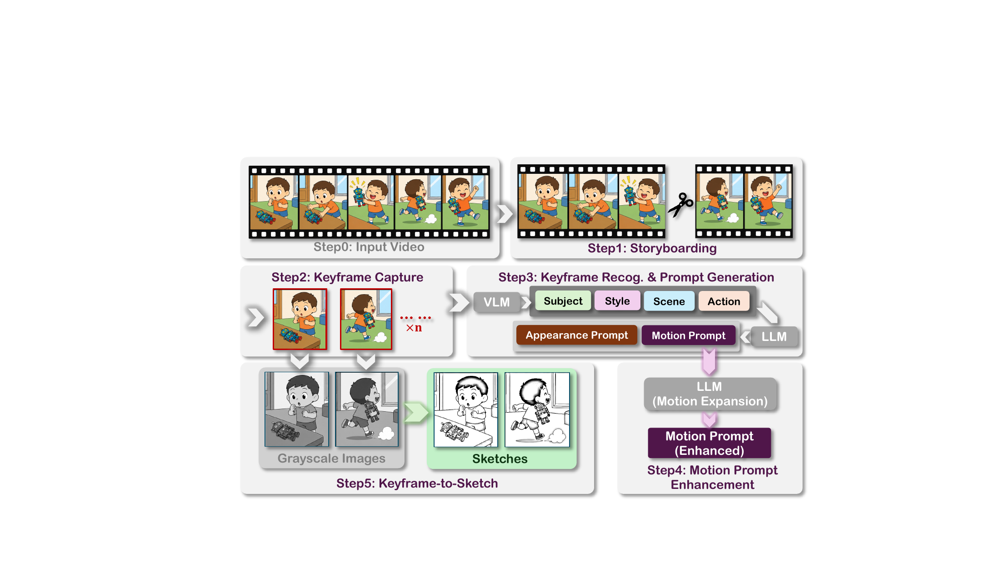
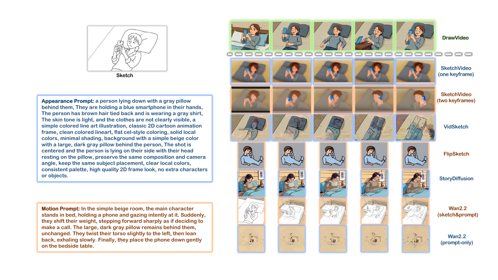

# DrawVideo

### Grounded and Faithful Multi-Shot Video Generation from Storyboard Keyframe Sketches

**NeurIPS 2026 Workshop on Grounded and Faithful Vision-Language Models for Real-World Deployment (VLM4RWD) · Poster**

Chuanzhi Xu\*, Huiqi Liang\*, Bang Shi, Huiming Zhang, Guangcheng Lin, Yifan Xiao, Haodong Chen, Qiang Qu, Zhicheng Lu, Weidong Cai

The University of Sydney · Charles Sturt University

\*Equal contribution.

[Paper](https://arxiv.org/abs/2605.23508) · [Dataset][sketchlongvideo] · [Setup](docs/setup.md) · [Evaluation](docs/evaluation.md)



DrawVideo is a training-free framework that generates multi-shot videos from a storyboard of **sketches**, **appearance prompts**, and **motion prompts**. Each shot is converted into a colored reference keyframe, five ordered derivative keyframes, and five first-last-frame video clips. Clips are assembled within shots, then shots are concatenated in storyboard order.

## Method



1. **Structured Prompt Decomposition:** Qwen2.5 enhances the appearance prompt and produces five conversion/dynamic prompt pairs.
2. **Sketch Coloring:** FLUX.1-dev with Canny-ControlNet creates a structure-aligned reference keyframe.
3. **Derivative Keyframes Generation:** FLUX.1 Kontext generates all five action states from the same reference keyframe.
4. **First-last-frame Video Generation:** Wan2.2-I2V-A14B synthesizes local transitions between adjacent keyframes.

## Quick Start

Use a CUDA-enabled Python environment with ComfyUI and the required models installed. See [setup and model filenames](docs/setup.md) for the complete configuration.

```bash
git clone https://github.com/LouckXu/DrawVideo.git
cd DrawVideo
python -m pip install -e .
export COMFYUI_PATH="$(pwd)/../ComfyUI"
ollama pull qwen2.5:7b
```

With the Ollama service running, first check the supplied two-shot example without loading models:

```bash
python -m drawvideo generate \
  --storyboard examples/storyboard/storyboard.json \
  --config configs/generation.json \
  --output-dir outputs/example \
  --dry-run
```

Generate the storyboard:

```bash
python -m drawvideo generate \
  --storyboard examples/storyboard/storyboard.json \
  --config configs/generation.json \
  --output-dir outputs/example
```

The default configuration uses five derivative keyframes and **81 frames per local clip**. Model files and sampling settings are configured in [`configs/generation.json`](configs/generation.json). Existing stage outputs are reused; add `--force` after changing inputs or settings. Stages can also be run individually with `decompose`, `color`, `keyframes`, or `video` in place of `generate`.

### Storyboard Input

```json
{
  "storyboard_id": "my_storyboard",
  "shots": [
    {
      "shot_id": "shot_001",
      "sketch": "sketches/shot_001.png",
      "appearance_prompt": "A character in a forest, with fixed clothing and composition.",
      "motion_prompt": "The character steps forward, turns, and raises one arm."
    }
  ]
}
```

Sketch paths are relative to the storyboard JSON. The order of the `shots` array determines the final video order. [Input/output naming](docs/naming.md) maps every field to the paper notation.

### Outputs

```text
outputs/example/
  generation_manifest.json
  storyboard_video.mp4
  shots/shot_001/
    structured_prompts.json
    reference_keyframe.png
    derivative_keyframe_01.png ... derivative_keyframe_05.png
    local_clip_01.mp4 ... local_clip_05.mp4
    shot_video.mp4
```

## SketchLongVideo

SketchLongVideo contains **1,233 aligned sketch/appearance/motion triplets across 126 storyboard sequences**, drawn from self-collected online animation, AnimeShooter, and AI-generated keyframes.



[Download SketchLongVideo][sketchlongvideo]. The repository includes a small two-shot example from the AI-generated subset; the full dataset and model weights are distributed separately.

| Subset | Storyboard sequences | Aligned triplets |
| --- | ---: | ---: |
| self-collected | 20 | 201 |
| AnimeShooter | 96 | 932 |
| AI-generated | 10 | 100 |
| **Total** | **126** | **1,233** |

The shared folder is named `SketchLongVideo Dataset`. Every `video_XXX` package contains `sketch`, `static_prompt`, and `story` folders, with matching filename stems:

```text
SketchLongVideo Dataset/
  self-collected/
  AnimeShooter/
  AI-generated/
    video_122/
      sketch/video_122_keyframe_0001.png
      static_prompt/video_122_keyframe_0001.txt
      story/video_122_keyframe_0001.txt
```

To import a downloaded video package into the public storyboard format:

```bash
python dataset/import_storyboard.py \
  --video-package "datasets/SketchLongVideo Dataset/AI-generated/video_122" \
  --output-dir outputs/storyboards/video_122
```

The downloaded package's `static_prompt` and `story` folders are imported as `appearance_prompt` and `motion_prompt`. Their text is preserved. See [dataset utilities](dataset/README.md).

## Results



Qualitative results from the paper compare DrawVideo with sketch-conditioned and text-based generation methods. The evaluation code covers shot control, intra-shot consistency, story alignment, event-based control, and auxiliary dynamic progression. See [evaluation instructions](docs/evaluation.md).

## Repository

```text
configs/             Model filenames and generation parameters
src/drawvideo/       Four-stage generation pipeline
dataset/             Dataset import and construction utilities
evaluation/          Metrics, evaluators, and annotation preparation
examples/storyboard/ Two-shot example with aligned input conditions
docs/assets/         Figures exported from the paper
tests/               Lightweight pipeline and backend contract tests
```

## Citation

```bibtex
@misc{xu2026drawvideo,
  title={DrawVideo: Generating Long Video from Storyboard Keyframe Sketches},
  author={Xu, Chuanzhi and Liang, Huiqi and Shi, Bang and Zhang, Huiming and Xiao, Yifan and Lin, Guangcheng and Chen, Haodong and Qu, Qiang and Lu, Zhicheng and Cai, Weidong},
  year={2026},
  eprint={2605.23508},
  archivePrefix={arXiv},
  primaryClass={cs.GR},
  url={https://arxiv.org/abs/2605.23508}
}
```

## Acknowledgments

DrawVideo uses [ComfyUI](https://github.com/Comfy-Org/ComfyUI), [ComfyUI-GGUF](https://github.com/city96/ComfyUI-GGUF), [ControlNet auxiliary preprocessors](https://github.com/Fannovel16/comfyui_controlnet_aux), Qwen2.5, FLUX.1-dev, FLUX.1 Kontext, Wan2.2, LLaVA-OneVision, and CLIP. Model weights, third-party code, and source datasets retain their respective licenses and usage terms; this repository does not redistribute model weights.

[sketchlongvideo]: https://unisyd-my.sharepoint.com/:f:/g/personal/chuanzhi_xu_sydney_edu_au/IgDJVV8IRQmbSLkgMj7NnchaAS29iBpAs3t2L4Lkr0-0qLQ?e=BhsbWB
